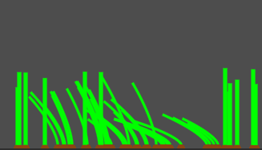

# Morgan the Dropout Grass Touching Simulator


## HG GJ 2025 Submission
https://domestic-cats.itch.io/morgan-the-dropout
### Motivation
1. I was committed to submit something small
1. I wanted to do something artsy without Sprites or models


## Code
I did timebox this to a day (plus my additional efforts to publish the code on day 2).  
No AI used. Just plain old spaghetti code with magic numbers.  
Feel free to copy anything usefull. I added a MIT license

### Touching Explanation
There are only 3 scenes:
1. main
2. corn.tscn, has only CornSeed class which is added as node "Seeder" in main. (sorry for the confusing naming...)
3. blade

Everything grass related is drawn to the Canvas of the SubViewport.
Seeder is a bit overkill, it just happedened to be usefull while developing. You could simply project the mouse_pos to the get_viewport_rect().size.y as the seeder does.

you can uncomment this in corn.gd to see my little helper which evovled to the plantig icon.
```
#draw_circle(p,10,Color.GREEN,false,2,true)
```

Most of the magic happens in canvas.gd.

All planted seeds are added to a dictionary which maps a x-Position to a Blade instance.

I use the previous mouse position to get a range and each x-Position from the dict which is within the range is "touched". Well if the mouses Y-Position is within the blade length.

Now there is whacky code which does some number juggling to get some kind of "force" value out of the distance between the mouse positions. This pseudo-force and direction is then used in the draw function of a touched blade. The calculation for the next blade point to draw is just some trial an error. The polynomial bending shape comes from the `x ** 1.5`. All the other factors and variables were tweaked until they felt nice.
